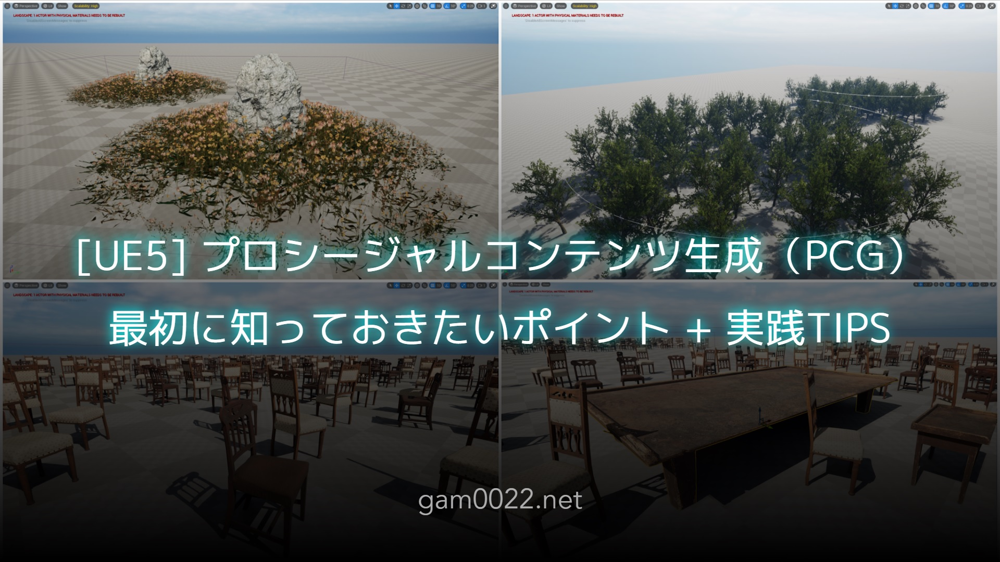

# UE5 Examples (UE 5.3.2)

This project is to experiment with UE5 features.

UE5の機能を実験するプロジェクトです。

## PCG Examples

- [[UE5] プロシージャルコンテンツ生成（PCG）最初に知っておきたいポイントと実践TIPS | gam0022.net](https://gam0022.net/blog/2024/01/01/ue5-pcg-introduction-tips/)
- [Content/PCGExamples](Content/PCGExamples)

## Object Space Raymarching

- [Object Space Raymarching in Unreal Engine 5.2 | gam0022.net](https://gam0022.net/blog/2023/07/31/raymarching-in-ue5/)
- [Content/PCGExamples](Content/Raymarching)
